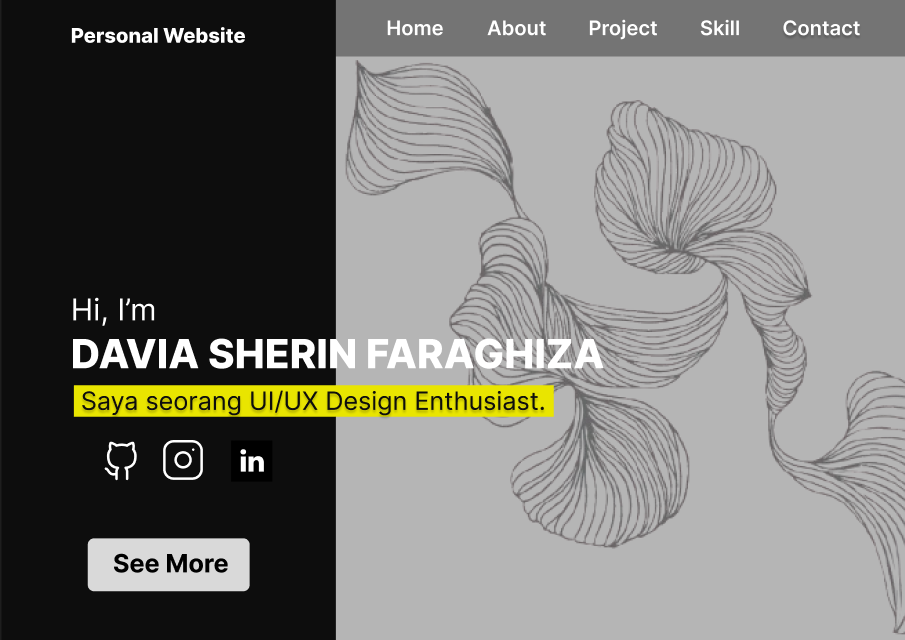

🌐 Personal Website 

This is my personal website where I showcase my portfolio and share my passion for UI/UX design. 
I focus on creating user-friendly and visually engaging digital experiences.

## Links

- [UI/UX Design Resources](https://www.figma.com/design/i48G6G043bKJyyJgeYSFWK/personal-web-davia?node-id=0-1&t=31HSyLNQY1SZ63Wz-1)

## Social Media

- [GitHub](https://github.com/daviasherin07/portofolio.git)
- [LinkedIn](https://www.linkedin.com/in/davia-sherin-2a0669382/)
- [Instragam](https://www.instagram.com/dviashrn?igsh=aGkzYmUwbXF4eGM3)

## Pages

- Home
- About
- Project
- Skill
- Contact

## Technologies Used

- HTML
- CSS
- JavaScript

## Preview

- 